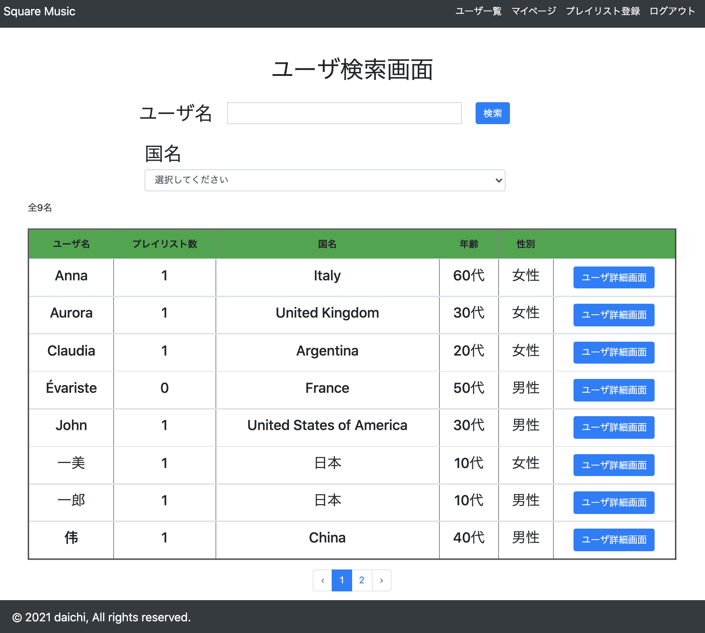
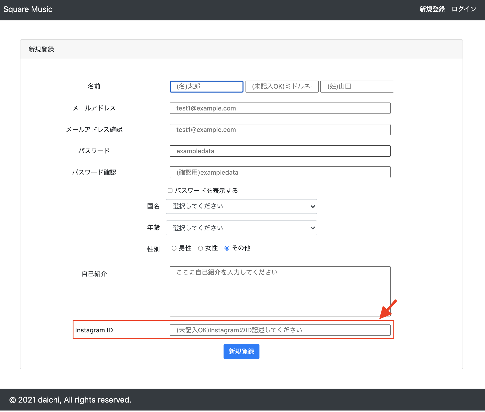

# 初めに

昔からものづくりと音楽が好きでした。

留学に行った際に海外の友達に「日本の曲教えて！！」と言われてオススメの曲を教えたけど「どんな曲名か忘れた」とよく言われたのでその状況を解決するために以前から興味のあったプログラミングを使い解決することを決意しました。

# アプリ概要

## タイトル

### <strong>Square Music</strong>

Square = 広場　　Music = 音楽

音楽をたくさんの人と共有していろんな国の音楽を知ることができて、話題の種になる場所を作りたかった。

 
 

## 開発の背景

### 自分の「あればいい」を実現する！

 

「海外の友達とたくさんのいい曲を共有したい」という思いから今回のアプリケーションを作ることにしました。

留学中に留学先で友達なった人たちに<b>「日本のオススメの曲を教えてよ！！」</b>と言われることがよくありました。 教えようとしたのですが、ここに<b>問題が1つ</b>ありした。

仮に好きな曲を教えたとしても母国の言葉でないために後で教えた曲を友達が調べようとしても忘れてしまっているということが多々ありました。

いろんなアプリで曲を共有することができるけど<b>「なぜ自分で作る必要があるのか??」</b>という疑問が出ると思いますが、理由があります。

Spotifyなどのストリーミングサービスでは、自身がたくさんのプレイリストをすでに登録していると思います。

<ul>
    <li>ドライブ用</li>
    <li>勉強中のBGM</li>
</ul>
など
 
 

今回の私の目的は、<b>「海外の友達と自国の好きな曲を共有して友達を増やしていく」</b>という一点に絞ってアプリケーションを作りたいという思いからこのアプリケーションを作成することを決めました

 
 

## 開発での使用言語

・HTML CSS JavaScript PHP/Laravel MySQL Docker Vagrant

 

## 今後、機能追加に当たって使用したい言語

・React TypeScript Python

 
 

## ターゲット

### ターゲット ①（私が留学中に仲良くなった友達）

<ul>
    <li>日本のことに興味を持ってくれている自分の友達</li>
</ul>

 

### ターゲット ②（留学生と仲良くなりたい日本人）

<ul>
    <li>英語を話せないけど文字ベースなら会話ができる人</li>
    <li>話す話題がすぐに尽きてしまう人</li>
</ul>

 

### ターゲット ③（日本に来ている留学生）

<ul>
    <li>日本人と友達になりたいけど話す話題がない</li>
</ul>

 
 

# 使用イメージ

 

### 新規登録、ログイン/ログアウト機能

 

<b>新規登録</b>

<b>ログイン</b>

＊ログインは、テスト用に input タグの value属性 に
 ・メールアドレス ・パスワード を記述しております。

 

### メール送信によりパスワード変更

Google アカウントを使用して、メールを送信 → パスワード変更を実現

 

下記の画像の順番にパスワードの変更を行っていきます。

 

### ユーザ検索機能

名前 or 国名でユーザを検索できる様にしております。

 

＊<b>あいまい検索可能</b>

 

### インスタグラムの ID 登録

ID登録後、インスタのアイコンをクリックすると登録したユーザのインスタページに飛ぶことが可能

<b>＊新規タブで開く様にしているため Square Music から一度離脱をしたとしてもまた Square Music アプリに戻ってくる可能性を高めている</b>

登録・変更方法は、3通りあります。

<ul>
    <li>ユーザ新規登録ページ</li>
    <li>プレイリスト登録ページ</li>
    <li>ユーザ編集</li>
</ul>

#### ユーザ新規登録ページ

 

#### プレイリスト登録ページ

 

#### ユーザ編集

＊このいづれか３つの場所でInstaram IDを登録すると、instagramのアイコンが付与され、そこから登録したインスタアカウントページに飛ぶことができます。

 

### プレイリストの説明

<b>プレイリストの説明</b>

<ul>
    <li>
        
ヘッダー部分

        <ul>
            <li>名前</li>
            <li>国名</li>
            <li>プレイリストのいいね数</li>
        </ul>
    </li>
    <li>
        
フッター部分

        <ul>
            <li>
                
ハートマーク

                
いいねを押すことができる

            </li>
            <li>
                
吹き出しマーク

                
チャットルームへ遷移

            </li>
            <li>
                
吹き出しマーク

                
チャットルームへ遷移

            </li>
            <li>
                
Instagramアイコン

                
自身が登録したinstagramプロフィールページに遷移する

            </li>
        </ul>
    </li>
    <li>
        
本体には、登録したプレイリスト表示

    </li>
</ul>

 
 

### Chat 機能

Ajax を使用してページ遷移をせずにチャットをできる様にしページ遷移の煩わしさを解消

 

### ユーザ情報削除

ユーザ削除のための確認ページを作りましたが、ワンクリックで削除では、誤操作による削除の可能性があるためモーダルウィンドウを使用

 
 

# 使用技術

### 開発環境

Vagrant・Docker(Dockerfile, Docker-compose.yml を使って、ローカルに環境を構築)

 

### フロントエンド

HTML/CSS Bootstrap JavaScript jQuery3.3.1

 

### バックエンド

PHP7.2.34/Laravel6.2

 

### ソースコード管理

Git/GitHub

 

### デプロイ環境

Heroku

 
 

# 機能一覧

課題解決のために必要な機能だけ実装することを意識しました。
|No.|必要機能候補|優先度|× の理由|
|---|---|---|---|
|1|ユーザ登録機能|○|-|
|2|ログイン機能|○|-|
|3|パスワード変更機能|○|-|
|4|プロフィール編集|○|-|
|5|プレイリスト登録機能|○|-|
|6|プロフィール編集|○|-|
|7|フォロー機能|○|-|
|8|いいね機能|○|-|
|9|ユーザ検索機能|○|-|
|10|chat 機能を ajax を使用して実装|○|-|
|11|SNS を登録できる様にする|○|-|
|12|レスポンシブ機能|△|バックエンドの処理を優先に実装していたのでデプロイ後に追加|
|13|アプリケーションの SPA 化|×|SPA を React を用いて実装したいため現在 React を学習中|

 
 

# DB 設計

 
 

# 工夫した点

### 1.実務案件の中で学んだことを自分のポートフォリオにも使用した。

実際に Laravel の実務案件にアサインした時に学んだ

<ul>
    <li><b>トランザクション</b></li>
    <li><b>変数名の命名の重要性</b></li>
    <li><b>PHPDocを記述</b>など</li>
</ul>

を自身のポートフォリオに追加していきました。

 

### 2.自力での解決。

自身でアプリケーションを作成の時は、教材の様に答えがないので最初はわからないことばかりでしたが、少しづつ理解が深まっていきました。

自身で考えてもわからない時は、<b>Udemyなどの動画を見る</b>・<b>Webサイトで概念を学び</b>少しづつアプリケーションを作成してきました。

それにより自分で解決するための<b>自己解決能力</b>・<b>解決のために必要な問題の細分化能力</b>が以前よりついたと感じます。

すぐに誰かに答えを聞くことも、時には大事かもしれませんが<b>自身でわからないことを調べたり</b>・<b>悩んで解決していく</b>ことが自分の能力向上には、最も欠かせないことだと感じました。

 

### 3.GitHub の活用

GitHub は、現場に入ると必ず使用するので、今回のポートフォリオ作りでも活用しました。
GitHub を使用したいに気をつけたこと

<ul>
    <li>ブランチをきり開発を進める</li>
    <li>pull requestの作成の際は、<b>追加・変更・削除・特記事項</b>など必要に応じて記述</li>
    <li>コミットの際は、コメントを残すなど</li>
</ul>

現場に入ると当たり前に必要であることを今回の開発でも取り入れて作成しました。

 
 

# 課題

以下が残存課題です。

<ul>
    <li>
        
SPA化をReactにより実現する

        
 =>Reactの学習が必要

    </li>
    <li>
        
Spotify APIを実装する

        
 =>Spotify APIは、Pythonを使用するのが一般的な様でPythonについて学ぶ必要がある

    </li>
    <li>
        
レスポンシブ対応

        
 =>ある程度は、グリッドシステムによりレスポンシブを気にして開発は、できたが完璧ではない

    </li> 
    <li>
        
リファクタリング

        
 =>フォームリクエストを作成して、そこにヴァリデーションルールを記述していく

    </li> 
    <li>
        
変数の名前の変更

        
 =>変数の名前がまだ一眼でわかる様には、できていないため変更の余地あり

    </li> 
    <li>
        
URI命名がわかりやすいか

        
 =>URIの命名は、「Webを支える技術」という本に準ずる

    </li> 
</ul>

 
 

# 学んだこと

私がこのポートフォリオ作りで大きく成長したと考えるのは、3点あります。

<ol>
    <li>
        
人に聞いてすぐにエラーを解決するのもいいが自分で悩み解決したことの方が知識の定着が早いと感じた

    </li>
    <li>
        
わからない箇所がある場合

        
その解決方法として、

        <ul>
            <li>わからない部分を言語化する</li>
            <li>言語化した問題について細分化をする</li>
        </ul>
        
この2つの順序にそってエラー・解決をしていくのが、自身でエラーを解決していく際の最も近道になることがわかりました。

    </li>
    <li>
        
MVCをしっかりと理解し使うことによりLaravelは格段に使いやすく可読性が上がるということがリファクタリングをしていく中で学ぶことができた

    </li>
</ol>
